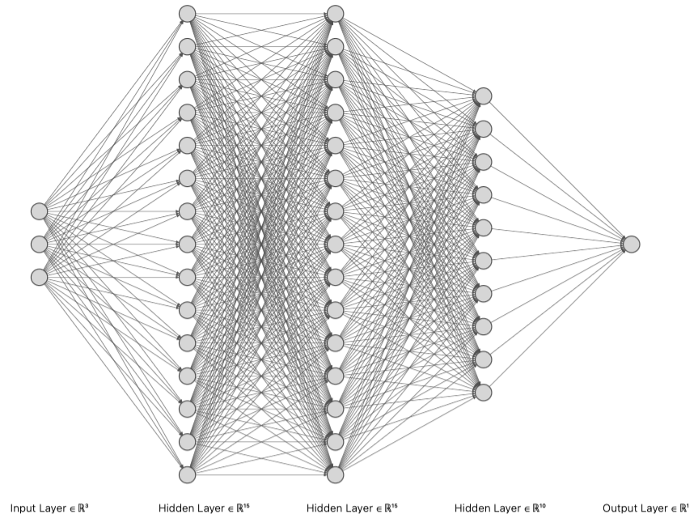

# microDSC_error_prediction_ANN
Prediction in the isobaric heat capacity measurement (at 298~K) deviation due to improper amount of the sample or/and calibration standard in Tian-Calvet microDSC

> Estimated ANN Model prediction accuracy over the test data is '99.98 %'



# Direction
Use python file 'mwe.py' file to predict the error in heat capacity measurement

**OR**

Minimum Working Example

```python:
# import module
from modul import *

# prediction of error/deviation in the heat capacity measurement
# use: prediction = dsc_error_model(Reference amount(ml), Sample amount(ml))
# NOTE: enter the sample and reference material amount in [ml] 

# Example 1: Reference amount(ml) = 0.8, Sample amount(ml)= 0.8
# 0.8~ml [full], 0.4~ml [half full], 2.6~ml [one third full]
Reference_amount = 0.8
Sample_amount = 0.8

error_pred = dsc_error_model(Reference_amount,Sample_amount)

```

The example output

```
1/1 [==============================] - 0s 81ms/step
----------------------------------------------------------------------
Reference amount [ml]:  0.8
Sample amount [ml]:  0.8
Heat capacity measurement deviation prediction (%):  [[0.42]]
COMMENT(s): 
            Sample and reference amount combination is appropriate.
            Consider 0.8~ml as standard amount to avoid any deviation in the measurement.
----------------------------------------------------------------------

```